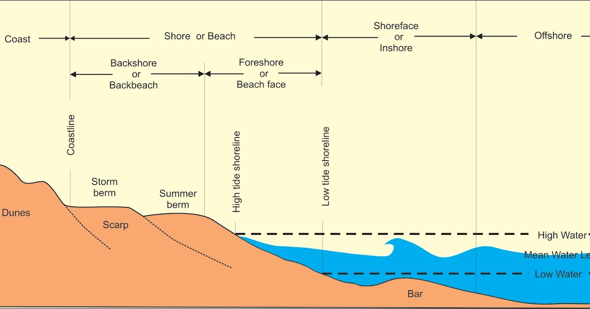
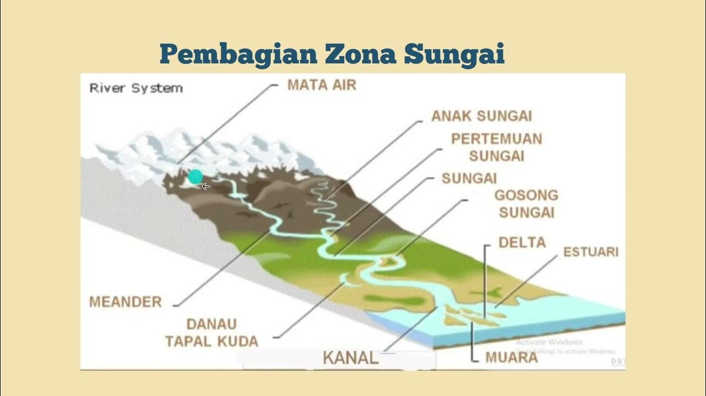
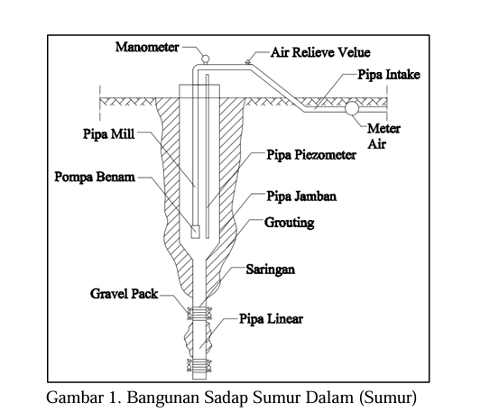
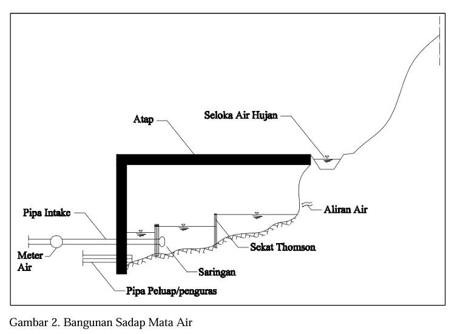
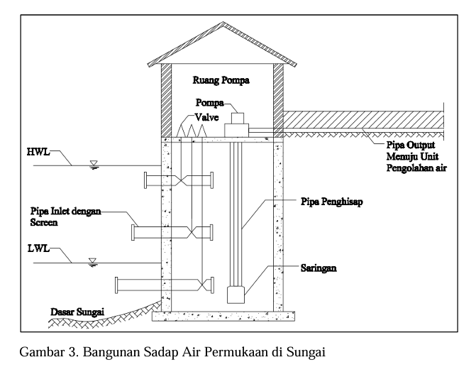

# ringkasan tambahan tahun 2019

air baku 1 
air baku 2
irigasi 2

## morfologi

### Morfologi Pantai

### Morfologi Sungai

## 5 pilar SDA
Konservasi, Pendayagunaan, Pengendalian Daya Rusak Air, Pemberdayaan Masyarakat, Sistem Informasi SDA.

## 5 pilar irigasi
Lima pilar irigasi menurut Permen PUPR No. 30/2015 adalah Ketersediaan Air, Infrastruktur Irigasi, Pengelolaan Irigasi, Institusi Irigasi, dan Sumber Daya Manusia.

## Bangunan air baku
### Bangunan Sadap Smur

### Bangunan Sadap Air Mata

* **Atap:** Melindungi bangunan dari hujan dan cuaca.
* **Seloka Air Hujan:** Tempat masuknya air hujan.
* **Aliran Air:** Menunjukkan arah aliran air dari sumber ke bangunan.
* **Sekat Thomson:** Alat untuk mengukur debit air.
* **Saringan:** Menyaring kotoran dan benda asing dari air.
* **Pipa Peluap/penguras:** Untuk membuang kelebihan air atau menguras air saat perawatan.
* **Pipa Intake:** Pipa untuk mengalirkan air yang sudah disaring.
* **Meter Air:** Mengukur volume air yang masuk.

### Bangunan Sadap air permukaan sungai

* **Bagian atas bangunan:** Terdapat ruang pompa yang berisi pompa dan valve.
* **Pipa Output:** Pipa ini mengalirkan air dari pompa menuju unit pengolahan air.
* **Pipa Penghisap:** Pipa ini menghisap air dari sungai menuju pompa.
* **Pipa Inlet dengan Screen:** Pipa inlet dilengkapi dengan screen untuk menyaring kotoran dan benda-benda asing dari air sungai sebelum masuk ke pipa penghisap.
* **Saringan:** Terletak di dasar sungai dekat pipa penghisap, kemungkinan berfungsi sebagai penyaring tambahan.
* **Dasar Sungai:** Menunjukkan dasar sungai tempat bangunan sadap air dibangun.
* **HWL (High Water Level):** Menunjukkan level air tertinggi di sungai.
* **LWL (Low Water Level):** Menunjukkan level air terendah di sungai.

## Metode Gumbel

Metode Gumbel adalah salah satu metode yang digunakan dalam analisis hujan rencana tahunan. Tujuan dari metode ini adalah untuk menentukan besarnya hujan yang dapat terjadi pada suatu tahun berdasarkan suatu data hujan maksimal yang tersimpan sebelumnya [1]. Metode Gumbel menggunakan distribusi Gumbel yang merupakan bentuk distribusi eksponensial yang terbatas di bawah [3].

Proses penentuan nilai hujan rencana tahunan dengan metode Gumbel terdiri dari dua langkah, yaitu mengidentifikasikan nilai simpangan dan metode Menotong-menau (Cut-Off) [5]. Nilai simpangan dapat didapat dengan menggunakan persamaan berikut [5]:

XT = X + k × S

dengan X merupakan nilai data hujan maksimum, S merupakan jarak antar nilai data hujan maksimum dan k merupakan nilai pembagi yang bisa didapatkan dengan rumus:

k = (Yr − Yn)/Sn

dimana Yr merupakan nilai hujan rencana terbesar, Yn merupakan nilai hujan rencana terendah, dan Sn merupakan nilai jarak antara beberapa nilai hujan maksimum [5].

Setelah mengetahui nilai simpangan, maka akan dihasilkan curah hujan rencana tahunan yang akan terjadi [4].

## debit limpasan

Debit kala ulang (kadang disebut juga debit banjir rancangan atau design flood discharge) adalah debit limpasan yang diperkirakan akan terlampaui, secara rata-rata, sekali dalam periode waktu tertentu yang disebut kala ulang. Kala ulang biasanya dinyatakan dalam tahun. Misalnya, debit kala ulang 100 tahun adalah debit yang diperkirakan akan terlampaui, secara rata-rata, sekali setiap 100 tahun.

Penting untuk dipahami bahwa debit kala ulang bukanlah prediksi pasti kapan suatu debit tertentu akan terjadi. Ini adalah pernyataan probabilitas. Debit kala ulang 100 tahun memiliki peluang 1% untuk terlampaui dalam satu tahun tertentu. Ini tidak berarti bahwa debit tersebut akan terjadi tepat sekali setiap 100 tahun, atau bahwa debit tersebut tidak akan terjadi lagi selama 100 tahun setelah terjadi. Bisa saja debit tersebut terlampaui beberapa kali dalam 100 tahun, atau bahkan tidak terlampaui sama sekali dalam periode yang lebih lama.

Debit kala ulang digunakan dalam berbagai aplikasi rekayasa dan perencanaan, termasuk:

Perancangan bangunan pengendali banjir: Seperti bendungan, tanggul, dan saluran drainase. Debit kala ulang digunakan untuk menentukan kapasitas struktur tersebut agar dapat menampung banjir dengan probabilitas tertentu.

Penentuan zona bahaya banjir: Untuk mengidentifikasi daerah yang berisiko tergenang banjir dan mengatur tata guna lahan di daerah tersebut.

Perencanaan tata ruang: Untuk menghindari pembangunan di daerah yang berpotensi terkena banjir besar.

Manajemen risiko banjir: Untuk menilai risiko dan kerugian potensial akibat banjir dan mengembangkan strategi mitigasi.

Penentuan debit kala ulang biasanya dilakukan dengan menganalisis data historis debit sungai. Data debit ini kemudian diplot pada grafik probabilitas dan diekstrapolasi untuk memperkirakan debit untuk kala ulang yang lebih lama. Beberapa metode statistik yang umum digunakan antara lain:

Metode Gumbel: Metode yang paling umum digunakan untuk menganalisis data debit ekstrem.

Metode Log-Pearson Tipe III: Metode yang direkomendasikan oleh U.S. Water Resources Council.
